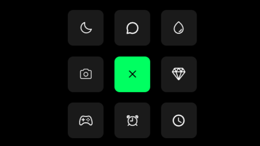

# [Animated Icon Grid](https://github.com/rajjitlai/Animated_Button)



A sleek, professional animated icon grid featuring a dark black theme and smooth, staggered transitions. Built with modern CSS and vanilla JavaScript.

## Features

- **Dark Black Theme**: Deep blacks and vibrant accents for a modern look.
- **Staggered Animations**: Fluid, sequential transitions for grid items.
- **Responsive Design**: Adapts to different screen sizes.
- **Interactive UI**: Hover effects with glowing filters and smooth scaling.

## Project Structure

```text
.
├── assets/
│   └── preview.png
├── css/
│   └── style.css
├── js/
│   └── main.js
├── index.html
├── LICENSE
└── README.md
```

## Technologies Used

- **HTML5**: Semantic structure.
- **CSS3**: Custom properties (variables), Flexbox, Grid, and smooth transitions.
- **JavaScript**: Optimized vanilla JS for DOM manipulation and animation timing.

## Getting Started

Simply open `index.html` in your favorite web browser to see the animation in action. Click the center button to toggle the grid animation.

## Customization

You can easily customize the theme by modifying the CSS variables in `css/style.css`:

```css
:root {
  --bg-color: #000000;
  --card-bg: #1a1a1a;
  --accent-color: #00ff61;
  /* ... */
}
```

## License

This project is licensed under the MIT License - see the [LICENSE](LICENSE) file for details.

---
Created by [Rajjit Laishram](https://github.com/rajjitlai)
